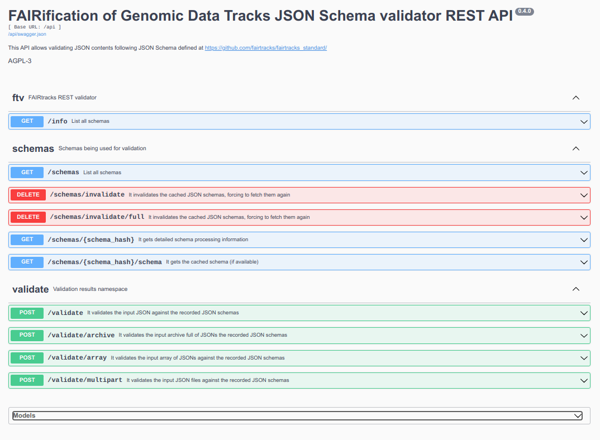

# FAIR Tracks Python Server JSON Schema Validator

FAIR Tracks validation server uses the [Python FAIRTracks extended validator](//github.com/fairtracks/fairtracks_validator_python), available in PyPI and also the organization of this repository.

The installation and setup instructions of this validation server are in [INSTALL.md](INSTALL.md) .

This server provides next endpoints:



Once you have properly installed the server, if you run it in debug mode and open http://127.0.0.1:5000/ you will be able to browse and test the FAIR Tracks JSON Schema validator API using the embedded Swagger UI instance. The OpenAPI definition is available at the standard location, http://127.0.0.1:5000/swagger.json

## Walk through using public server

[](https://asciinema.org/a/279246)

## Usage examples with a local instance and [cURL](https://curl.haxx.se/)

* Validating a single file:

  ```
  curl -H 'Content-Type: application/json' -X POST --data-binary @./fairtracks_experiment.example.json http://localhost:5000/validate
  ```

* Validating several files at once, using [jq](https://github.com/stedolan/jq):

```
jq -s . fairtracks*.json | curl -H 'Content-Type: application/json' -X POST --data-binary @- http://localhost:5000/validate/array
```

* Validating several files at once, using `tar`:

```
tar cf - fairtracks*.json | curl -H 'Content-Type: application/x-tar' -X POST --data-binary @- http://localhost:5000/validate/archive
```

* Validating several files at once, using `zip`:

```
zip -9r /tmp/examples.zip examples
curl -H 'Content-Type: application/zip' -X POST --data-binary @/tmp/examples.zip http://localhost:5000/validate/archive
```

* Validating several files at once, through multipart/form-data

```
curl -F file=@fairtracks_experiment.example.json -F file=@fairtracks_track.example.json http://localhost:5000/validate/multipart
```
